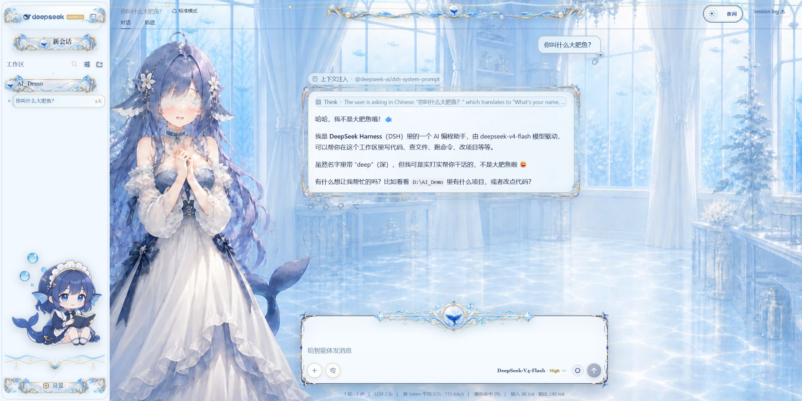
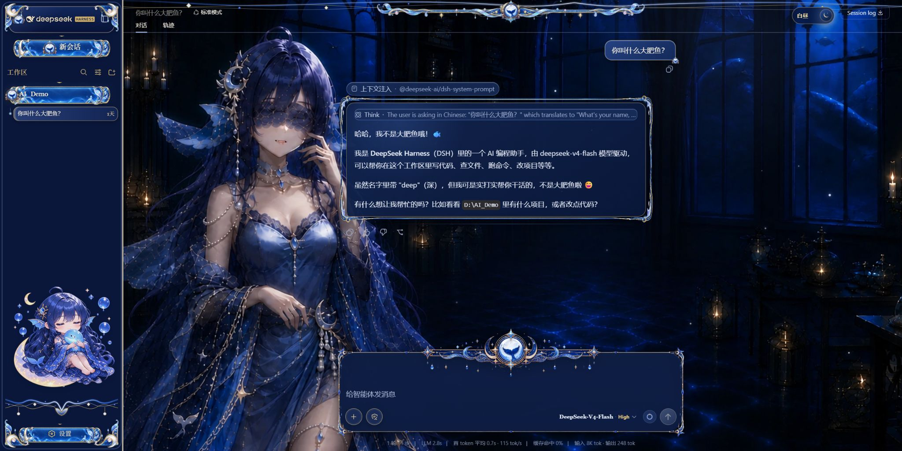

# Deep Whale Day & Night Theme · 鲸鱼娘昼夜工坊

> **Non-commercial / 禁止商用：** This project is released under CC BY-NC-SA 4.0. Personal and other non-commercial use is permitted with attribution; commercial use is prohibited, and adaptations must use the same license. 本项目采用 CC BY-NC-SA 4.0，允许保留署名的个人及其他非商业使用，禁止商业使用，衍生作品必须以相同许可证共享。

A complete day/night character UI skin for the DeepSeek Harness Web GUI. It replaces only the presentation layer: the native theme service switches the full scene, character, companion, controls, ornaments, and lightweight atmosphere without reading or changing sessions, model requests, or workspace data.

面向 DeepSeek Harness Web GUI 的完整鲸鱼娘昼夜主题。它只修改展示层：原生主题服务会同步切换场景、角色、侧栏宠物、控件、花边与轻量动态特效，不读取或更改会话、模型请求和工作区数据。

## Screenshots · 主题截图

| Day · 白昼 | Night · 黑夜 |
| --- | --- |
|  |  |

## Features · 功能

- Complete crystal-workshop day scene and moon-tide observatory night scene with independent palettes, system title colors, character plates, and transparent chibi companions. / 完整的白昼水晶工坊与夜晚月潮观测室，分别使用独立色板、系统标题栏颜色、角色图和透明 Q 版侧栏宠物。
- Full component coverage for new sessions, workspace trees, session lists, chat cards, context injection, thinking rows, composer, model and permission menus, settings, tools, Todo, terminal, title bar, and collapsed sidebar. / 覆盖新建会话、工作区树、会话列表、聊天卡片、上下文注入、思考行、输入框、模型与权限菜单、设置、工具、Todo、终端、标题栏和折叠侧栏。
- Paired day/night top and bottom flourishes, fixed whale-tail crests, composer crown rails, sidebar ribbons, nine-slice frames, and workspace ornaments that keep their source proportions. / 昼夜成对的顶部与底部花边、固定鲸尾徽章、输入框顶饰、侧栏飘带、九宫格边框和工作区装饰均保持源图比例。
- The composer crown is separated from the content background; its outer tips align with the top border while the center emblem spans the rim without blocking native controls. / 输入框顶饰与内容背景分离，两侧尖角对齐顶部边框，中央徽章跨坐边线且不遮挡原生控件。
- Deterministic atmosphere with 24 staggered rising bubbles by day and 24 slowly drifting stars by night; `prefers-reduced-motion` disables the loops. / 白昼使用 24 个错峰上浮气泡，夜晚使用 24 个缓慢漂移星点；`prefers-reduced-motion` 会停用循环动画。
- All runtime artwork is embedded into the client bundle as data URIs, so the installed skin requires no remote asset service. / 所有运行时素材均以内嵌 data URI 进入客户端 bundle，安装后的主题不依赖远程素材服务。

## Requirements · 使用条件

- A working DeepSeek Harness checkout with the Web GUI profile.
- `dsh` available on the command line for plugin installation.
- Node.js and pnpm are required only when rebuilding or running tests from source.

## Install from the Release ZIP · 从 Release 安装

1. Download `deep-whale-day-night-theme-v0.1.1.zip` and `SHA256SUMS.txt` from the [v0.1.1 release](https://github.com/GGBond2424648901/deep-whale-day-night-theme/releases/tag/v0.1.1).
2. Verify the ZIP SHA-256 against `SHA256SUMS.txt`, then extract it to a permanent directory.
3. From the Harness checkout, add the extracted theme package:

```sh
dsh plugin --profile web add /absolute/path/to/deep-whale-day-night-theme-v0.1.1
```

## Install from Source · 从源码安装

```sh
git clone https://github.com/GGBond2424648901/deep-whale-day-night-theme.git
cd <harness>
dsh plugin --profile web add /absolute/path/to/deep-whale-day-night-theme
```

The plugin activates when loaded and restores every CSS, DOM, page-title, and system-color change when unloaded. It remains compatible with mutually exclusive switching through the Harness skin center; its wiring ID is `ui-skin-maid-atelier`.

插件加载后立即生效，卸载时会还原全部 CSS、DOM、页面标题和系统颜色写入。它兼容 Harness 皮肤中心的互斥切换，wiring ID 为 `ui-skin-maid-atelier`。

## Day and Night Switching · 昼夜切换

Use the native top-right theme control. Day mode applies pearl white, ice blue, sapphire text, champagne-gold edges, rising bubbles, and the crystal scene. Night mode applies deep-sea blue, cobalt glass, moon-silver text, warm-gold edges, drifting stars, and the observatory scene. View Transition provides the circular reveal where supported, with a short fade fallback elsewhere.

使用右上角原生主题按钮切换。白昼模式采用珍珠白、冰蓝、蓝宝石文字、香槟金细边、上浮气泡和水晶场景；夜晚模式采用深海蓝、钴蓝玻璃、月银文字、暖金细边、漂移星点和观测室场景。支持 View Transition 时使用圆形揭幕，不支持时自动退化为短淡入。

## Development · 开发

```sh
pnpm install
pnpm run embed:assets
pnpm run typecheck
pnpm run test
pnpm run build
```

`assets/` contains editable scene, character, companion, composer, trim, and component artwork. `scripts/embed-deep-whale-art.mjs` generates `src/client/deep-whale-art.generated.ts`; `src/client/ornament-art.ts` owns the non-distorting vector rails; and `lib/` contains the committed prebuilt package.

`assets/` 保存可编辑的场景、角色、宠物、输入框、花边与组件素材。`scripts/embed-deep-whale-art.mjs` 生成 `src/client/deep-whale-art.generated.ts`，`src/client/ornament-art.ts` 负责不变形的矢量长轨，`lib/` 保存已提交的预编译包。

## Repository Layout · 目录结构

```text
assets/       Editable day/night artwork and generated UI slices
lib/          Prebuilt installable JavaScript
preview/      Compact light and dark previews
screenshots/  Full-page day and night captures
scripts/      Artwork embedding and build helpers
src/          TypeScript source and client skin
tests/        UI, asset, behavior, and distribution contracts
```

## Compatibility · 兼容性

The skin targets the DeepSeek Harness Web GUI and peers with `@deepseek-ai/cordis` and `@deepseek-ai/dsh-client-ui-theme`. It keeps native controls, accessibility attributes, keyboard focus, menus, dialogs, and upstream auto-grow behavior; the skin is not a replacement for Harness itself.

本主题面向 DeepSeek Harness Web GUI，并以 `@deepseek-ai/cordis` 和 `@deepseek-ai/dsh-client-ui-theme` 为 peer dependencies。它保留原生控件、无障碍属性、键盘焦点、菜单、对话框和上游自动增高行为，不包含 Harness 主程序。

## Attribution and License · 署名与许可

This repository is distributed under **Creative Commons Attribution-NonCommercial-ShareAlike 4.0 International**. The controlling terms are in [LICENSE](LICENSE); the complete three-stage creator and generation attribution chain is in [NOTICE](NOTICE).

本仓库以 **知识共享署名-非商业性使用-相同方式共享 4.0 国际许可协议**发布。完整法律条款见 [LICENSE](LICENSE)，三阶段创作者与生成过程署名链见 [NOTICE](NOTICE)。

Original character creator: **上善** ([Pixiv](https://www.pixiv.net/users/62155430)). Secondary DeepSeek maid redesign: **zipzip** ([Pixiv](https://www.pixiv.net/users/18604994)). Theme adaptation and UI preparation: **Small-tailqwq**.

DeepSeek and related names or logos are the property of their respective owners. This fan-made non-commercial project does not imply official endorsement or affiliation.
